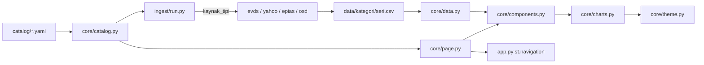

# Repository Guidelines

## Project Overview

BV Market Dashboard — a Streamlit dashboard of Turkish macro/market/commodity
series for BV Portföy internal use. Data is fetched by a scheduled ingest job,
committed into the repo as CSV, and read at runtime by a read-only app.

Two invariants shape everything:

1. **`catalog/series.yaml` is the single source of truth.** Adding a series or
   category is a YAML edit, not a code change. The sidebar, pages, charts, KPI
   cards, and the ingest work list are all generated from the catalog.
2. **The app never touches secrets.** Credentials exist only in GitHub Actions
   (and a local gitignored `.env`) for ingest. The deployed app only reads CSVs.

**All identifiers, docstrings, comments, and UI strings are Turkish.** Follow
that convention (`seri_cek`, `kategorileri_yukle`, `KatalogHatasi`) — do not
introduce English names into existing modules.

## Architecture & Data Flow



**Ingest (write path, CI only).** `ingest/run.py` lists catalog series and
dispatches each by `seri.kaynak_tipi` to a duck-typed adapter (no ABC/Protocol).
The shared contract is `seri_cek(seri, ..., session=...) -> pd.DataFrame` with
columns `date,value` — or `date,<Component>,…` wide for composition series.
`seriyi_yaz` writes `df.to_csv(yol, index=False, float_format="%.5f")`.

**Render (read path, runtime).** `app.py` builds one `st.Page` per category via
`core.page.kategori_sayfasi_yap(kategori)`, then `st.navigation({...}).run()`.
There is **no `pages/` directory** — navigation is fully generated. A single
chart flows: `page._kategoriyi_ciz` → `catalog.seri_listele(slug)` →
`components.grafik_karti` → `data.load_series` → `stats.gorunum_uygula` →
`charts.mevsimsellik_figuru` → `st.plotly_chart`.

**Module layering.** `core/stats.py` and `core/theme.py` are dependency-free
leaves. `core/takvim.py` deliberately does not import Streamlit (pure
computation; rendering lives in `core/page.py`). Keep that separation.

## Key Directories

| Path | Purpose |
|---|---|
| `core/` | App layer: catalog, data I/O, stats, charts, theme, components, page, takvim |
| `ingest/` | `run.py` orchestrator + one adapter per source (`evds`, `yahoo`, `epias`, `osd`) |
| `catalog/` | `series.yaml` (40 series), `categories.yaml` (8 categories) |
| `data/<kategori>/<seri>.csv` | 40 committed CSV artifacts, one per series |
| `tests/` | 15 flat pytest files, no `conftest.py`, no fixture data files |
| `docs/superpowers/{specs,plans}/` | Per-phase design specs and execution plans (Turkish) |

## Development Commands

```bash
pip install -r requirements-dev.txt        # dev/test (superset of ingest + runtime)
streamlit run app.py                       # dev server
pytest                                     # suite; network tests auto-excluded
pytest tests/test_epias.py                 # one file
pytest -m network                          # live-network smoke tests only
EVDS_API_KEY=<key> python -m ingest.run    # refresh all data
python -m ingest.run --only enflasyon/tufe-genel   # debug one series
```

`ingest.run` exit codes: `0` all good, `1` at least one series failed,
`2` config error (unknown `--only` id, or missing required credentials).

**No lint, format, or type-check tooling is configured** — no ruff/black/mypy
config, no pre-commit. Do not add or run one uninvited; match surrounding style.

## Code Conventions & Common Patterns

- **Turkish snake_case identifiers** everywhere, including test names
  (`test_pencere_29_subatta_patlamaz`).
- `from __future__ import annotations` plus modern `X | None` hints in all
  `core/` modules.
- **Frozen dataclasses, not dicts/TypedDict/pydantic**: `Kaynak`, `Kategori`,
  `Seri` (`core/catalog.py`), `TakvimSatiri` (`core/takvim.py`).
- **Caching is split by layer**: `@lru_cache(maxsize=1)` for catalog loaders;
  `@st.cache_data(show_spinner=False)` for `load_series`/`load_wide_series`.
- **Fail loud; never silently misrepresent data.** Custom exceptions
  `KatalogHatasi(Exception)` and `VeriYokHatasi(FileNotFoundError)`. Adapters use
  `kayit[alan]` (raising `KeyError`) rather than `.get()` so an upstream field
  rename crashes ingest instead of writing zeros. `paylara_cevir` yields `NaN`
  on a zero-sum row rather than fake 0% shares.
- **Errors are caught only at render boundaries**, per-item: `components.py`
  turns `VeriYokHatasi` into `st.warning`; `takvim.takvim()` catches per series
  so "a broken CSV drops one row, not the page".
- **Failure isolation in ingest**: one series' exception is collected into
  `hatalar` and never stops the loop; an EPİAŞ login failure drops only
  EPİAŞ-typed series.
- **Run-scoped caches** (`epias_onbellek`, `osd_onbellek`) are created in
  `main()` and threaded through `_cek()` so series sharing an upstream response
  (or PDF bulletin) fetch it once. A single `requests.Session` is shared per run.
- **No `st.session_state`.** Widget state is keyed inline, e.g.
  `key=f"gorunum_{kategori.slug}"`, `key=f"kompozisyon_{seri.id}"`.
- Comments carry provenance and defect IDs (`# C1:`, `(M5)`, "Faz 3c final
  incelemesinin Critical bulgusu") tying code to `docs/superpowers/` specs.
  Preserve these; they encode why non-obvious code exists.

### Adding a series

Append to `catalog/series.yaml`, then generate its CSV. `kaynak_tipi` is a
discriminated-union tag; `core/catalog.py::KAYNAK_ALANLARI` defines which extra
fields each type requires and `_dogrula` rejects fields owned by another type.

```yaml
- id: <kategori>/<ad>          # MUST start with "<category>/"
  title: Görünen Ad
  category: <kategori>         # must exist in categories.yaml
  kaynak: { name: TCMB EVDS, url: "https://evds3.tcmb.gov.tr" }
  kaynak_tipi: evds            # evds | yahoo | epias | osd
  unit: "Birim"
  freq: monthly                # daily | weekly | monthly
  evds_code: TP.XXX.YYY
  evds_frequency: "5"          # "1" günlük | "2" haftalık | "5" aylık
  monthly_agg: mean            # mean | last | sum
  charts: [seasonality, level]
```

Then: `python -m ingest.run --only <kategori>/<ad>`.

Type-specific fields: `yahoo_symbol`; `epias_ucu`/`epias_alani`
(+`epias_bilesenler` for composition); `osd_firma` (+`osd_eski_adlar`).
Optional `olcek` scales values (e.g. `0.001` for MWh→GWh).

## Important Files

- `app.py` — entry point; `st.set_page_config` + catalog-driven `st.navigation`.
- `core/catalog.py` — dataclasses, `KAYNAK_ALANLARI`, `_dogrula` validation,
  `seri_listele`/`seri_getir`, and `KOK` (repo root) used by `core/data.py`.
- `core/data.py` — the **only** gateway to `data/`. `seri_csv_oku` returns a
  single-`value` DatetimeIndex frame; `genis_csv_oku` keeps all columns for
  composition series (contracts intentionally not unified).
- `core/page.py::_kategoriyi_ciz` — generic per-category renderer (view selector,
  KPI row, freshness expander, 2-column chart grid).
- `core/theme.py` — dark-mode palette constants only. `RENKLER["kategorik"]` and
  `CIZGI_DESENLERI` keys must match `epias_bilesenler` group names 1:1
  (`tests/test_theme.py` enforces this).
- `.github/workflows/ingest.yml` — daily `cron: "0 6 * * *"` (09:00 TSİ);
  `permissions: contents: write`; runs `python -m ingest.run` then
  `git add data` + conditional commit/push under `if: always()`.
- `.github/workflows/test.yml` — `pytest -v` on every push and PR.
- `.streamlit/config.toml` — dark navy/gold theme, `headless = true`.

## Runtime/Tooling Preferences

- **Python 3.12**, pinned in both workflows. `pyproject.toml` has **no
  `[project]` or `[build-system]` table** — the repo is not an installable
  package; run it directly. Imports resolve via pytest's `pythonpath = ["."]`.
- **Plain `pip`** with layered requirements; no Poetry/uv/pipenv, no lockfile:
  `requirements.txt` (app: streamlit, pandas, plotly, PyYAML, requests) ⊂
  `requirements-ingest.txt` (+pdfplumber) ⊂ `requirements-dev.txt` (+pytest).
  Keep `pdfplumber` out of `requirements.txt` — Streamlit Cloud installs that
  file and must not gain the PDF dependency.
- Dependencies use lower bounds only (`streamlit>=1.49`); no upper pins.
- Env vars, ingest-time only: `EVDS_API_KEY`, `EPIAS_USERNAME`,
  `EPIAS_PASSWORD` (GitHub secrets; local gitignored `.env`).
- Deploy: Streamlit Community Cloud, private repo, viewer allowlist.

## Testing & QA

- **pytest**, plain `assert`, Turkish test names, no `conftest.py`, no
  `parametrize` (repeated cases are separate functions), `pytest.approx` for
  floats, `pytest.raises(Type, match="…")` to pin type *and* message.
- Fakes are hand-rolled per file — local `SahteOturum`/`SahteYanit` HTTP stubs
  plus `monkeypatch.setattr` on adapter functions. No `responses`/`requests_mock`
  /`pytest-mock`. Fixture data is inline literals; `tmp_path` for file I/O.
- Network tests live only in `tests/test_smoke_network.py`
  (`pytestmark = pytest.mark.network`, per-test `pytest.skip` on missing creds)
  and are excluded by default:

```toml
[tool.pytest.ini_options]
pythonpath = ["."]
testpaths = ["tests"]
addopts = "-m 'not network'"
markers = [
    "network: gerçek kaynağa istek atar; kimlik bilgisi ve internet ister",
]
```

- **No coverage config** (`--cov`, `.coveragerc`, `[tool.coverage]` all absent).
  Don't claim coverage numbers.
- Assertions target observable behavior. Plotly internals
  (`fig.data[0].line.color`) are asserted only because they *are* the contract
  of a chart factory.
- Catalog loaders are `@lru_cache`d: any test overriding
  `catalog.KATALOG_DIZINI` MUST `cache_clear()` before **and** after in
  `try/finally`, or later tests silently read stale data.

## Gotchas

- **CSVs are fully rewritten every run, never appended** — "tam pencereyi
  yeniden çeker (artımlı değil — revizyonlar yakalanmalı)". A careless change to
  an adapter's date-window logic silently truncates history on the next cron.
- **EPİAŞ**: hard 89-day request window (`AZAMI_PENCERE_GUN`; exceeding it →
  HTTP 400 `(BUS)SEF1117`), hence `pencereleri_bol`. The TGT ticket has no
  refresh logic (~2h validity, fine only because a run takes minutes). Incomplete
  hourly days are dropped via the 24-hour completeness filter.
- **EVDS** uses the undocumented `POST https://evds3.tcmb.gov.tr/igmevdsms-dis/fe`
  with a `key` header — not the official evds2 REST API. Values arrive with
  Turkish thousands separators and need stripping.
- **Yahoo requires a Googlebot User-Agent**; a browser UA returns HTTP 429.
- **OSD** bulletin URLs cannot be derived, so the index page is scraped each
  run; `dogrula()` cross-checks per-firm pages 6–9 against the page-2 TOTAL
  column (tolerance 0.5) and requires ≥13 firms, raising on template drift.
- `evds.py`/`yahoo.py` docstrings record reverse-engineered upstream behavior and
  say explicitly not to rediscover it from scratch. Read them before editing.
- **`README.md` is partly stale**: its architecture tree lists only
  `evds.py + yahoo.py + run.py` (EPİAŞ and OSD adapters also exist) and its
  roadmap marks Faz 3 as "Planlandı" though `faz3a`–`faz3e` are implemented.
  Trust the code and `docs/superpowers/specs/` over the README.
- `docs/superpowers/` convention: `specs/YYYY-MM-DD-faz<N><letter>-<slug>-design.md`
  paired with `plans/YYYY-MM-DD-faz<N><letter>-<slug>.md`. Specs carry
  `Durum: Onaylandı` and back-references; the original Next.js/TS spec
  (`2026-08-26-bvmarketdashboard-design.md`) is **superseded** by
  `2026-08-27-streamlit-dashboard-design.md`.
- There is **no `.superpowers/sdd/` content** — don't assume SDD tooling.
